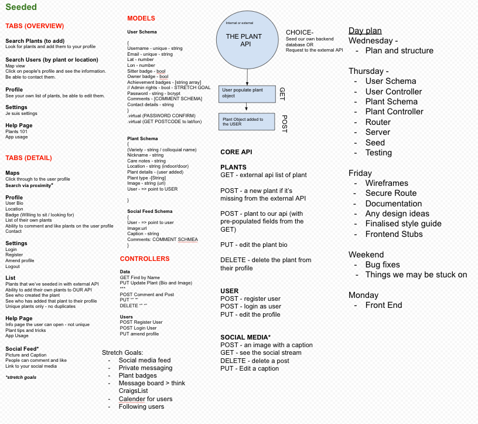
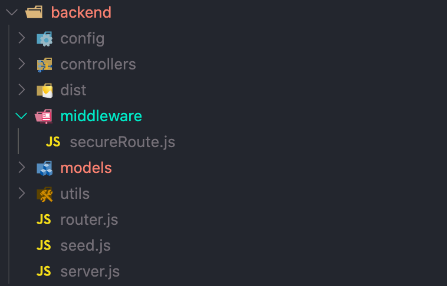
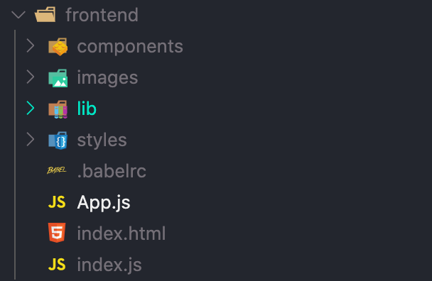
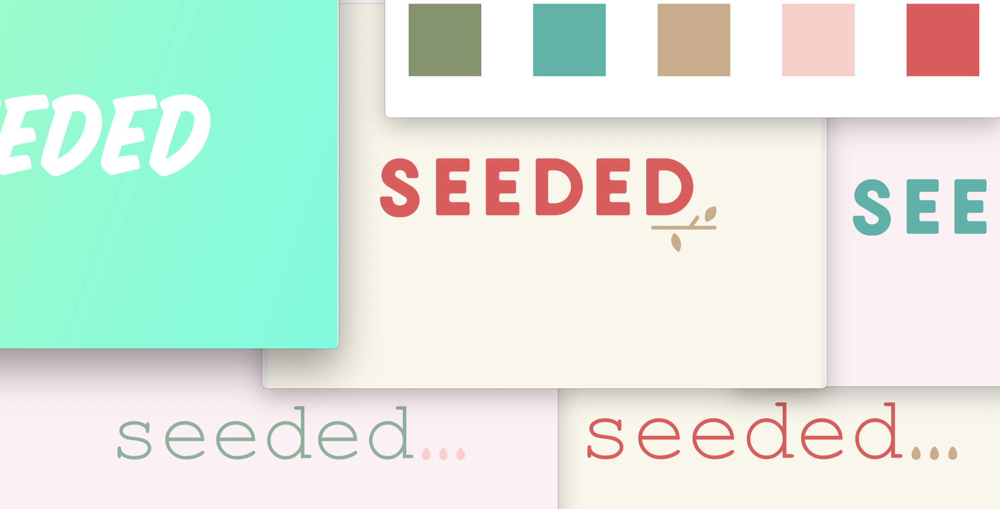
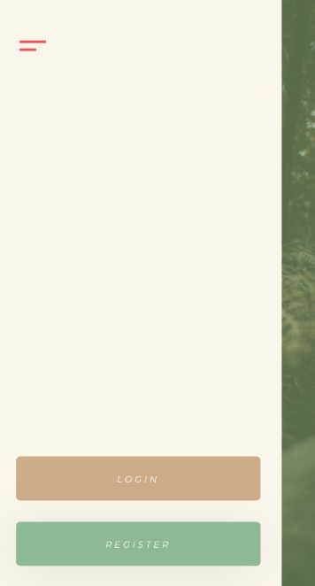
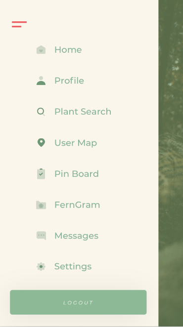
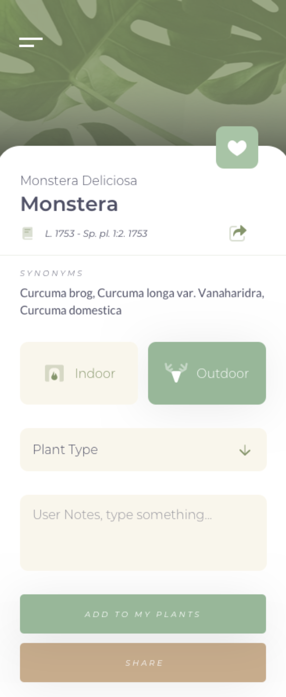

### project-3
#  
# MERN Full Stack Application - Seeded, A Plant Baby Sitting App For Ferns In Your Area!
### By  [Laurence](https://github.com/ProDigresser) and Co-Contributors- [Rebecca](https://github.com/rebeccaacioadea), [Enrico](https://github.com/bacxhus) & [Rachel](https://github.com/rachel-beale)
		    				░░              ░░                  
					      ▒▒              ▒▒                  
					    ▒▒░░▒▒          ▒▒  ▒▒                
					    ▒▒░░░░▒▒      ▒▒░░  ▒▒                
					    ▒▒░░░░░░▒▒  ▒▒░░░░  ▒▒                
					      ▒▒▒▒░░░░▒▒░░  ▒▒▒▒                  
					          ▒▒▒▒▒▒▒▒▒▒                      
					        ▓▓▓▓▓▓▒▒▓▓▓▓▓▓                    
					      ▓▓████▓▓▒▒██▓▓▓▓▓▓                  
					    ██████▓▓▓▓▒▒▓▓▓▓▓▓▓▓██                
					  ██▓▓██████████████████░░██              
					  ██▓▓▓▓██████████████▒▒░░██              
					  ██▓▓▓▓▒▒▒▒▒▒▒▒▒▒▒▒▒▒▒▒░░██              
					    ██▓▓▓▓▓▓▒▒▒▒▒▒▒▒░░░░▓▓                
					    ████████▓▓▓▓▓▓▓▓██████                
					    ██▓▓▓▓▓▓▓▓▓▓▓▓▓▓▓▓▓▓██                
					    ██▓▓▓▓▒▒▒▒▒▒▒▒▒▒▒▒░░██                
					    ██▓▓▓▓▒▒▒▒▒▒▒▒▒▒▒▒░░██                
					    ██▓▓▓▓▒▒▒▒▒▒▒▒▒▒▒▒░░██                
					      ██▓▓▓▓▒▒▒▒▒▒░░░░▓▓                  
					      ░░██▓▓▓▓▓▓▓▓▓▓▓▓░░                  
					      
## The Overview
This project is a Group Programming task - set as part of the Software Engineering Immersive Course from General Assembly.

This task involved working together to develop a Full Stack application using MERN - MongoDB, Express, React and Node. This project took place over the course of 7 working days.

After deliberation and discussion we decided to develop an app that allowed its users to sign up and help look after plants of fellow owners. We also concluded that we could use this base idea to build a feature rich app - pulling from external databases, responsive map integration, social media (with image uploading) and message boards.

Find it here! --> [🌺](https://prodigresser-seeded.herokuapp.com/)

### The Brief

- Collaborative development using Git and GitHub
- Develop a Full Stack Application
- Build a database and store information to it using MongoDB
- Navigate the database using Node and an Express API
- Emphasis on RESTful design to serve data programmatically
- Serve the API though a separate Front End using React
- Deliver a complete product outfitted with CRUD functionality
- Design a visually impressive Front End, with mobile responsiveness as a key element
- Deploy the application online


### Technologies Used

- MongoDB & Mongoose
- Node
- Express
- React 
- Git & GitHub
- Heroku (deployment)

## The App

In order to work as a team and develop coherently - we took time looking at the different faucets that we thought were key to this app, and worked though the development process methodically. These were the steps we identified-

1. Develop an understanding of what our user story would look like
2. Formulate a backend structure of key endpoints and potential APIs
3. Develop the core backend features as a group and get a clear understanding of the backend structure before diving in further
4. Gather the external APIs we would be using and initiate them on the back end 
5. Attach the backend endpoints to the front end using React
6. Form a style guide - including a wireframe, colour pallette and logo 

### The User Stroy and Backend Framework

Our first day as a team was spent looking at how we wanted our application to fit together - key pieces of UI, what our Schema might look like for various bits of data. Identifying what external APIs we would need and how we would interact with them.
We also started to look at what CRUD we would like our API to use, along with a loose daily plan for the first few days ahead. 



As for the User Story - key functionally would be a clean and inviting landing page, easy registration and login. From there navigation is unlocked - users could then build their portfolio of plants from a database, go to the message board and post looking for a plat sitter or add comments offering help. Additionally as a stretch goal a user could go to the social media platform and upload pictures and comment on posts.

### The APIs 

While this application uses a couple of APIs there are two core APIs that we access for its main functionality.

The key external API we identified was this - [treffle.io](https://trefle.io/). A large searchable API with an easy to use set of endpoints and a comprehensive plant database, rich specific in details and relatively flexible. A standard search would return an array of 30 plants.

Here is a data sample for what a plant would look like:

Endpoint-
```html
https://trefle.io/api/v1/plants/search?token=YOUR_TREFLE_TOKEN&q=strawberry
```
Sample response-
```json
{
  "id": 130695,
  "common_name": "Indian strawberry",
  "slug": "potentilla-indica",
  "scientific_name": "Potentilla indica",
  "year": 1904,
  "bibliography": "P.F.A.Ascherson & K.O.R.Graebner, Syn. Mitteleur. Fl. 6(1): 661 (1904)",
  "author": "(Andrews) Th.Wolf",
  "status": "accepted",
  "rank": "species",
  "family_common_name": "Rose family",
  "genus_id": 618,
  "image_url": "https://bs.floristic.org/image/o/376a1744fe8b6b92da0cb05545bc4ee81ef43aca",
  "synonyms": [
    "Fragaria indica",
    "Duchesnea indica",
    "Potentilla indica var. microphylla",
    "Potentilla durandii",
    "Fragaria nilagirica",
    "Fragaria malayana",
    "Duchesnea indica var. major",
    "Duchesnea major",
    "Potentilla trifida",
    "Potentilla denticulosa",
    "Duchesnea indica var. albicarpa"
  ],
  "genus": "Potentilla",
  "family": "Rosaceae",
  "links": {
    "self": "/api/v1/species/potentilla-indica",
    "plant": "/api/v1/plants/potentilla-indica",
    "genus": "/api/v1/genus/potentilla"
  }
}
```

For our internal API - this is where our Users would be stored, Plants saved to our API, Messages and Comments on the message board and Social posts with Comments.
Here are a few examples of the APIs we designed, along with their Schemas:

JSON Object of a plant-
```json
{
  "_id": "5fb7e62e9b5d9d29c20376f0",
  "image": "https://bs.floristic.org/image/1abc01027d5c9b6fb586da94752149d468c88554",
  "commonName": "Barrel cactus",
  "scientificName": "Kroenleinia grusonii",
  "careNotes": "Water once a month. Keep in sunlight",
  "outdoor": false,
  "user": "5fb7e62e9b5d9d29c20376e1",
  "createdAt": "2020-11-20T15:52:14.825Z",
  "updatedAt": "2020-11-20T15:52:14.825Z",
  "__v": 0
}
```
Plant Schema in Javascript using Mongoose-
```javascript
const dataSchema = new mongoose.Schema({
  image: { type: String, required: true },
  commonName: { type: String, required: true },
  scientificName: { type: String, required: true },
  library: { type: String },
  synonyms: { type: String },
  careNotes: { type: String },
  outdoor: { type: Boolean },
  plantType: { type: String },
  user: { type: mongoose.Schema.ObjectId, ref: 'User', required: true }
}, {
  timestamps: true
})
```
We identified authenticating inputs from users as important - and as such we employed a few methods -

REGEX patterns for password strength and email authenticity -
```javascript
email: { 
    type: String, required: true, unique: true,
    match: /^(([^<>()\[\]\\.,;:\s@"]+(\.[^<>()\[\]\\.,;:\s@"]+)*)|(".+"))@((\[[0-9]{1,3}\.[0-9]{1,3}\.[0-9]{1,3}\.[0-9]{1,3}])|(([a-zA-Z\-0-9]+\.)+[a-zA-Z]{2,}))$/
  }
password: { 
    type: String, required: true, minlength: 6, 
    match: /(?=.*\d)(?=.*[a-z])(?=.*[A-Z])(.*\W){1}.*$/
  }
```
Using Mongoose methods to Validate
```javascript
userSchema
  .pre('validate', function checkPassword(next) {
    if (this.password !== this._passwordConfirmation) {
      this.invalidate('passwordConfirmation', 'Should Match Password')
    }
    next()
  })
```

### The Backend
A clean, consistent, and RESTful structure was key to developing this app - using a clear separation of the function of each component.



We started by developing the backend together, starting with server.js, router.js, the middleware and models for the database. 

Here is a sample of the router.js - that carries data though to the controllers and authenticates through a secure route when necessary:
```javascript
// ! PLANTS
// Grabbing from external API
router.route('/plants-external/:query')
  .get(dataController.getExternalData)
// Adding to OUR API
router.route('/plants')
  .post(secureRoute, dataController.addPlants)
  .get(dataController.getPlants)
// Editing OUR API
router.route('/plants/:id')
  .get(dataController.singlePlant)
  .delete(secureRoute, dataController.deletePlants)
  .put(secureRoute, dataController.editPlants)
//  Get Plants By User
router.route('/users-plants/:userid')
  .get(dataController.getPlantsByUser)
// ! USERS
// REGISTER
router.route('/user/register')
  .post(userController.registerUser)
// LOGIN
router.route('/user/login')
  .post(userController.loginUser)
```

Here is a sample of the Secure Route - used to authenticate logged in users:
```javascript
jwt.verify(token, secret, (err, payload) => {
    if (err) return res.status(401).send({ message: 'Unauthorized, Bad/Expired Token' })
    const userId = payload.sub
    User 
      .findById(userId)
      .then(user => {
        if (!user) return res.status(401).send({ message: 'Unauthorized, User Not Found' }) 
        //DESCRIPTIVE ERROR MESSAGES
        req.currentUser = user
        next()
      })
      .catch(() => res.status(401).send({ message: 'Unauthorized, an error occurred' }))
  })
```
For this we used the JSON Web Token (JWT) method to generate authentication.

Finally in the backend we have the controllers - where our API requests go. This is where all of our CRUD functions are executed.
Here are a few examples:

This is a sample of the message board, to get all messages-
```javascript
function getMessages(req, res) {
  Message
    .find().sort({ 'createdAt': -1 })
    .populate('user')
    .populate('comments.user')
    .then(resp => res.send(resp))
}
```
This example lets a User edit their account-
```javascript
function editUser(req, res) {
  const userId = req.params.userid
  const body = req.body
  const currentUserId = req.currentUser._id
  User
    .findById(userId)
    .then(user => {
      if (!user) return res.send({ message: 'No User Found' })
      if (!user.equals(currentUserId)) return res.send({ message: 'Unauthorized User' })
      user.set(body)
      user.save()
      res.send(user)
    })
    .catch(err => res.send(err))
}
```

And this example allows a user to delete a nested comment from the social feed (unfortunately not implemented)-
```javascript
function deleteNestedComment(req, res) {
  const socialId = req.params.socialid
  const commentId = req.params.commentid
  const nestedId = req.params.nestedid
  Social
    .findById(socialId)
    .then(post => {
      if (!post) return res.status(404).send({ message: 'Message not found.' })
      if (!req.currentUser.isAdmin && !post.user.equals(req.currentUser._id) 
      || !post.directComments.id(commentId).secondComments.id(nestedId).equals(req.currentUser._id)) {
        return res.status(401).send({ message: 'Unauthorized' })
      }
      post.directComments.id(commentId).secondComments.id(nestedId).remove()
      post.save()
      res.send(post)
    })
}
```

### The Front End & React

Next is the front end - we started with a common development framework for react:

1. Render the page through index.html 'root'
2. Pass the data though index.js ^
3. Import the components through App.js with a React Router ^
4. Store components separately ^

Shown here - a well defined file structure:



The key to this application was to attach the APIs to the front end, and to make it easy to pass information between the two. To do this we used React hooks, UseState and UseEffect along with tools like Axios.

Here is an example of how these technologies come together:
```javascript
const [formData, updateFormData] = useState({
    userName: '',
    password: ''
  })
  const [errors, updateErrors] = useState('')
  function handleChange(event) {
    const name = event.target.name
    const value = event.target.value
    const data = {
      ...formData,
      [name]: value
    }
    updateFormData(data)
  }
  function handleSubmit(event) {
    event.preventDefault()
    Axios.post('/api/user/login/', formData)
      .then(resp => {
        localStorage.setItem('token', resp.data.token)
        props.history.push('/')
      })
      .then(() => {
        location.reload()
      })
      .catch(error => {
        updateErrors(error)
        return error
      })
  }
```
Here is another example where a user searches for a plant:
```javascript
const [results, updateResults] = useState([])
  const [query, updateQuery] = useState('')
  const [typedWord, updateTypedWord] = useState('')

  const searchFunction = (query) => {
    if (query) {
      axios.get(`api/plants-external/${query}`)
        .then(resp => {
          updateResults(resp.data.data)
        })
    }
  }

  useEffect(() => {
    return searchFunction(query)
  }, [query])

  function enterKey(event) {
    if (event.key === 'Enter') {
      updateQuery(typedWord)
    }
  }
```
And here is the JSX for mapping the response data:
```javascript
{results && results.map((plant, index) => {
  return <Link key={index}
    to={{ pathname: `/add-plant/${plant.id}`, state: { plant } }} >
    <div style={{ backgroundImage: `linear-gradient(rgba(129, 150, 103, 0.9), rgba(129, 150, 103, 0.9)), url(${plant.image_url})` }}
      className="list-item" id="search-profile">
      <h3>{plant.common_name} </h3>
      <h4>{plant.scientific_name}</h4>
    </div>
  </Link>
  })}

```
Here is an example of combining two external APIs using [Postcode.io](https://postcodes.io/) and [Mapbox](https://www.mapbox.com/): 
Here we are pulling the coordinates of a User from their porvided Postcode- 
```javascript
const [userData, updateUserData] = useState([])
const [longLat, updateLongLat] = useState([])
const [popupInfo, updatePopupInfo] = useState(null)
useEffect(() => {
  axios.get('/api/user/users')
    .then(resp => {
      updateUserData(resp.data)
      const promise = []
      resp.data.forEach((user) => {
        promise.push(new Promise((resolve) => {
          setTimeout(() => {
            axios.get(`/api/post-code/${user.postcode}`)
              .then(({ data }) => {
                const position = {
                  long: data.result.longitude,
                  lat: data.result.latitude,
                  user: user._id,
                  name: user.name,
                  bio: user.bio,
                  sitter: user.sitter
                }
                resolve(position)
              })
          }, 300)
        }))
        return Promise.all(promise).then((values) => {
          updateLongLat(values)
        })
      })
    })
}, [])
```
And here is mapbox being renderd on the page as a component with markers:
```javascript
<MapGL {...viewPort}
  mapboxApiAccessToken={'pk.eyJ1IjoicmFjaGVsYmVhbGUiLCJhIjoiY2tobmIyMGNnMDAxcTJ0cGVodGpxMDdjaCJ9.jIEvNHrY6OQ45Q05K2SO_w'}
  mapStyle="mapbox://styles/rachelbeale/ckhoxbpuf299a19mmtb9arg8a"
  onViewportChange={(viewPort) => setViewPort(viewPort)}>
  {longLat.map(user => {
    return <Marker
      key={user.user}
      latitude={user.lat}
      longitude={user.long}>
      {user.sitter === true ?
      <button className="markerSitter"
        onClick={event => {
          event.preventDefault()
          updatePopupInfo(user)
      }}></button>
      :
      <button className="markerOwner"
      onClick={event => {
        event.preventDefault()
        updatePopupInfo(user)
      }}></button>}
    </Marker>
  })}
  {popupInfo ? <Popup
    latitude={popupInfo.lat}
    longitude={popupInfo.long}
    onClose={() => {
      updatePopupInfo(null)
    }}>
    <Link to={`/user-page/${popupInfo.user}`}>
      <h2>{popupInfo.name}</h2>
      <p>{popupInfo.bio}</p>
    </Link>
  </Popup>
  : null}
</MapGL >
```

Here we have an example of image uploading using [Cloudinary](https://cloudinary.com/) and it's upload widget:
```javascript
const [feedData, updateFeedData] = useState([])
const [text, setText] = useState('')
const token = localStorage.getItem('token')
const [inputValue, updateInputValue] = useState('')
const [postData, updatePostData] = useState({
  caption: '',
  image: ''
})
useEffect(() => {
  axios.get('/api/social', {
    headers: { Authorization: `Bearer ${token}` }
  })
    .then(resp => {
      const data = resp.data
      console.log(data)
      updateFeedData(data)
    })
}, [])
function handleUpload() {
  window.cloudinary.createUploadWidget(
    {
      cloudName: 'seeded',
      uploadPreset: 'ml_default'
    },
    (err, result) => {
      if (result.event !== 'success') {
        return
      }
      console.log(result.info.url)
      updatePostData({
        ...postData,
        image: result.info.url
      })
    }
  ).open()
}
function handleChange(e) {
  updateInputValue(e.target.value)
  updatePostData({
    ...postData,
    caption: e.target.value
  })
}
```

### Styling & React

We considered coherent styling and themes to be super important to an enjoyable experience. We spent time considering the layout, color theme, logo design and layout. Much of this was done using [InVision](https://www.invisionapp.com/), with our colleague Enrico providing excellent design direction. 

This is an example of colour schemes and logo design: 


And here we have an example of the wireframing in InVision:



## The Result!

In the end we put together and launched an app that I am vary proud of. It is feature rich and looks amazing and is easy to use.

It was an interesting challenge working in a group, each of us coming together and sharing each others strengths and covering each other weaknesses. It was also helpful to troubleshoot with people who were familiar with the project. It has also been a huge learning experience to build a back end and to design an API from scratch.

Finally - there were some pieces that we did not get to finish. This included implementing nested comments on the social media platform and the endpoints that came with it. Going foward, I would also like to take more care for the mobile intergration and usability - which I believe is not quite complete.

You can check the site out [here](https://prodigresser-seeded.herokuapp.com/).

Thanks for visiting, and remember to water your plants!

[README-files/home.png](https://prodigresser-seeded.herokuapp.com/)
